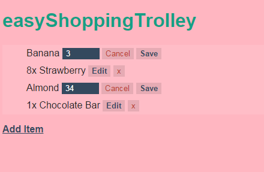

# qingmingsang.github.io
大部分更在[codepen](https://codepen.io/qingmingsang/pens/popular)

[flex demo](http://qingmingsang.github.io/css3/flex/flex_base.html)

[transform demo](http://qingmingsang.github.io/css3/transform/translate.html)

[file to base64](http://qingmingsang.github.io/tools/fileToBase64.html)

[github search facebook patent licence](http://qingmingsang.github.io/tools/github_search.html)

[redux stack](http://qingmingsang.github.io/static/reduxStack.pdf)